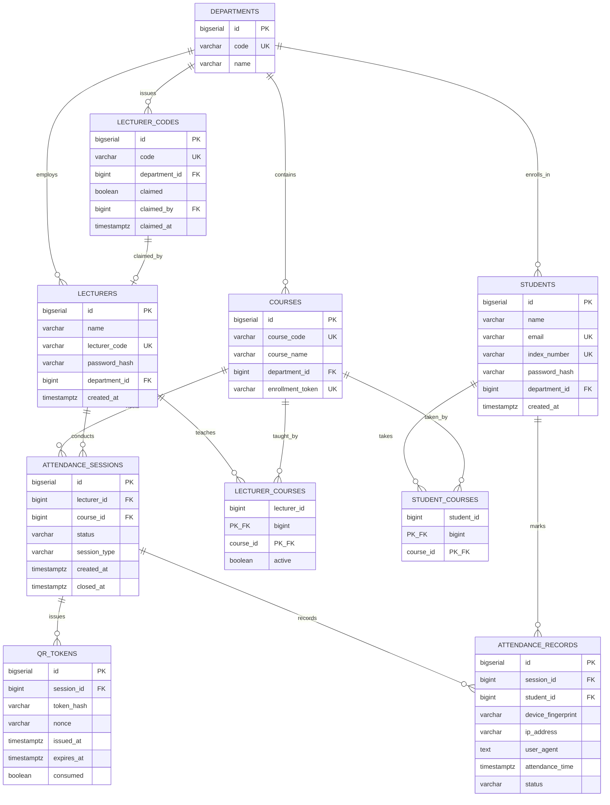
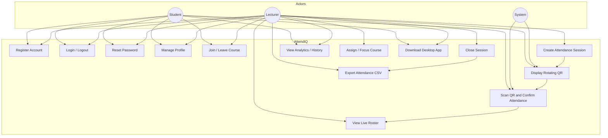
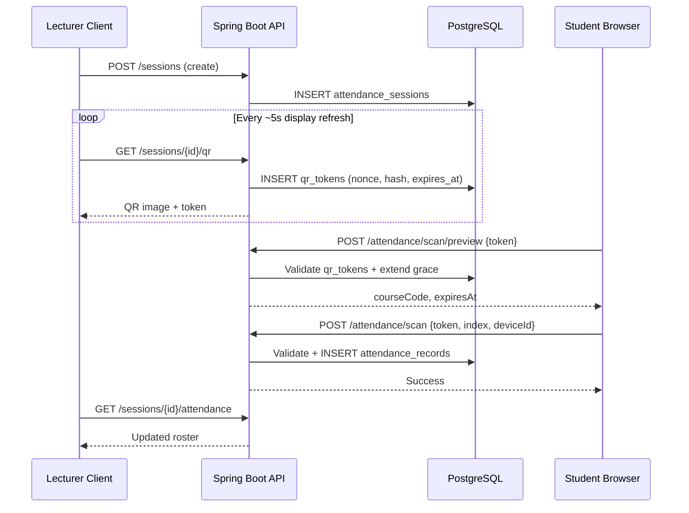

# AttendIQ — Software Requirements Specification (SRS)

| Field | Value |
|-------|-------|
| **Document ID** | SRS-ATTENDIQ-001 |
| **Product** | AttendIQ — Smart Attendance System |
| **Institution** | University of Cape Coast (UCC) — Beta Pilot |
| **Version** | 1.2.0 (as-implemented baseline) |
| **Status** | Approved for beta / defense reference |
| **Production URL** | https://ucc-attendance-system.onrender.com |
| **Desktop Release** | https://github.com/KingdomJoe/attendiq-ucc/releases/tag/v1.2.0 |
| **Author** | Joseph Fiah |
| **Last updated** | June 2026 |

---

## Table of Contents

1. [Introduction](#1-introduction)
2. [Overall Description](#2-overall-description)
3. [User Classes and Characteristics](#3-user-classes-and-characteristics)
4. [System Context](#4-system-context)
5. [Functional Requirements](#5-functional-requirements)
6. [Non-Functional Requirements](#6-non-functional-requirements)
7. [External Interface Requirements](#7-external-interface-requirements)
8. [Data Requirements](#8-data-requirements)
9. [Use Case Model](#9-use-case-model)
10. [Forecasting: Future Functional Requirements](#10-forecasting-future-functional-requirements)
11. [Requirements Traceability Matrix](#11-requirements-traceability-matrix)
12. [Appendices](#12-appendices)

---

## 1. Introduction

### 1.1 Purpose

This Software Requirements Specification (SRS) defines the functional and non-functional requirements for **AttendIQ**, a fraud-resistant classroom attendance management system. It consolidates the original product requirements (`APP-PRD.md`), architecture documentation (`docs/architecture_reference.md`), implementation reality (commits through **v1.2.0**), and beta-test findings from production validation.

The document is intended for:

- Academic defense and project evaluation
- Development and maintenance teams
- Beta testers and institutional stakeholders
- Future contributors extending the platform

### 1.2 Scope

AttendIQ digitizes classroom attendance through **lecturer-controlled sessions** that display **rotating, cryptographically signed QR codes**. Students mark attendance via a **mobile-friendly web portal**; lecturers may additionally use a **Windows JavaFX desktop client** optimized for classroom projection.

**In scope (implemented):**

- Student and lecturer registration, login, profile management, password reset
- Course enrollment, assignment, and focus-course selection
- Attendance session lifecycle (create, active QR display, close)
- QR-based attendance marking with anti-fraud validation
- Real-time attendance rosters, statistics, analytics, CSV export
- Hybrid deployment: Render (web/API) + GitHub Releases (desktop installer)

**Out of scope (planned / future):**

- Administrator portal
- Email-based password recovery
- Native mobile apps (iOS/Android)
- Facial recognition, GPS geofencing (Phase 2)
- Multi-tenant SaaS billing

### 1.3 Definitions and Acronyms

| Term | Definition |
|------|------------|
| **Session** | A lecturer-initiated attendance window tied to one course |
| **QR token** | Short-lived signed JWT embedded in a QR image; bound to session, course, and nonce |
| **Nonce** | Unique identifier per issued QR; stored hashed in `qr_tokens` |
| **Device fingerprint** | Client-generated stable ID (localStorage UUID + server metadata) used to limit one mark per device per session |
| **TTL** | Time-to-live; default **90 seconds** per issued QR token (configurable) |
| **Confirm grace** | Server-side extension (**60 seconds**) applied when a student previews a scanned QR, allowing time to confirm index number |
| **Focus course** | Lecturer's currently active course driving dashboard metrics |
| **Enrollment token** | Per-course unique link for student self-enrollment |
| **JWT** | JSON Web Token used for authentication (separate signing context from QR tokens) |
| **Flyway** | Database migration tool; sole authority for schema changes |

### 1.4 References

| Document | Location |
|----------|----------|
| Product Requirements Document | `APP-PRD.md` |
| Architecture Reference | `docs/architecture_reference.md` |
| Project Mastery Guide | `docs/PROJECT_MASTERY_GUIDE.md` |
| Demo Runbook | `docs/DEMO_RUNBOOK.md` |
| Executive Summary | `docs/EXECUTIVE_SUMMARY.md` |
| Defense Q&A | `docs/DEFENSE_QA_FLASHCARDS.md` |
| E2E Validation Checklist | `docs/E2E-VALIDATION.md` |
| Safe Change Patterns | `docs/safe_change_patterns.md` |
| Database Migrations | `backend/src/main/resources/db/migration/V1–V5` |

---

## 2. Overall Description

### 2.1 Product Perspective

AttendIQ is a **hybrid client–server system** with a single Spring Boot backend serving two client types:

```
┌─────────────────────┐     ┌─────────────────────┐
│   Web Browser       │     │  JavaFX Desktop     │
│ (Student + Lecturer)│     │  (Lecturer focus)   │
│ Thymeleaf + JS      │     │  FXML + ApiClient   │
└──────────┬──────────┘     └──────────┬──────────┘
           │    JWT (cookie / Bearer)   │
           └────────────┬───────────────┘
                        ▼
           ┌────────────────────────────┐
           │   Spring Boot 3 Backend    │
           │   REST API + Web UI        │
           │   Spring Security + JWT    │
           └────────────┬───────────────┘
                        ▼
           ┌────────────────────────────┐
           │   PostgreSQL 16 + Flyway    │
           └────────────────────────────┘
```

### 2.2 Problem Statement

Traditional attendance methods suffer from:

- **Proxy attendance** (students signing for absent peers)
- **Time waste** (manual roll calls consuming class time)
- **Inaccurate records** (paper registers, spreadsheet errors)
- **No real-time visibility** for lecturers during class
- **Weak audit trails** (no device or timestamp metadata)

AttendIQ addresses these through dynamic QR sessions, authenticated student verification, enrollment checks, device binding, and centralized digital records.

### 2.3 Product Objectives

| Priority | Objective |
|----------|-----------|
| Primary | Digitize attendance with fraud resistance |
| Primary | Enable lecturers to control session start/end and view live rosters |
| Primary | Provide students fast mobile-browser marking |
| Secondary | Course analytics and CSV export for departmental records |
| Secondary | Windows desktop presenter for classroom projection |
| Tertiary | Institutional scalability (departments, courses, seeded data) |

### 2.4 Design Constraints

| Constraint | Description |
|------------|-------------|
| **Hybrid auth** | Web uses HttpOnly cookie; desktop uses in-memory JWT + Bearer header — must never be conflated |
| **Schema ownership** | Flyway migrations only; Hibernate `ddl-auto: validate` |
| **Browser privacy** | No hardware device IDs; fingerprint via client UUID + IP + User-Agent |
| **QR rotation vs validity** | Desktop **displays** new QR every ~5 seconds; each issued token remains valid for **TTL window** (default 90s) |
| **Hosting** | Render free tier (cold-start latency acceptable for beta only) |
| **Desktop platform** | Windows installer via jpackage; Java 17+ for JAR-only distribution |

### 2.5 Assumptions and Dependencies

- Students have smartphones or laptops with camera access and modern browsers
- Lecturers have internet connectivity during sessions
- PostgreSQL is available (Render managed Postgres in production)
- Institutional email pattern is configurable (`STUDENT_EMAIL_PATTERN`)
- Lecturer registration requires a pre-seeded `lecturer_codes` entry (one-time claim)

---

## 3. User Classes and Characteristics

| User Class | Client(s) | Technical Skill | Primary Goals |
|------------|-----------|-----------------|---------------|
| **Student** | Web browser | Low–medium | Register, join courses, scan QR, view history |
| **Lecturer** | Web + Desktop | Medium | Run sessions, project QR, monitor roster, export data |
| **Administrator** | — (future) | Medium | Manage departments, users, system-wide reports |
| **Developer / DevOps** | CLI, GitHub Actions | High | Deploy, migrate DB, publish desktop releases |

### 3.1 Demo Accounts (Beta)

| Role | Identifier | Password |
|------|------------|----------|
| Lecturer | `LEC001` | `lecturer123` |
| Student | `student@ucc.edu.gh` | `student123` |

---

## 4. System Context

### 4.1 Technology Stack (As Implemented)

| Layer | Technology |
|-------|------------|
| Language | Java 17 |
| Backend framework | Spring Boot 3.3.5, Spring Security 6 |
| Authentication | JWT (jjwt), BCrypt password hashing |
| Web UI | Thymeleaf, vanilla JavaScript, CSS |
| Desktop UI | JavaFX 21, FXML |
| QR generation | ZXing 3.5.3 (server-side PNG base64) |
| QR scanning | Browser camera API, upload fallback, manual token entry |
| Database | PostgreSQL 16 |
| Migrations | Flyway V1–V5 |
| Build | Maven multi-module (`backend`, `desktop`) |
| CI/CD | GitHub Actions — desktop JAR + Windows EXE on version tags |
| Hosting | Render (web/API); GitHub Releases (desktop) |

### 4.2 Deployment Architecture

| Environment | Web/API | Database | Desktop |
|-------------|---------|----------|---------|
| **Production** | Render (`ucc-attendance-system.onrender.com`) | Render Postgres | GitHub Releases `v1.2.0` |
| **Local dev** | `localhost:8080` | Docker Compose Postgres | `mvn javafx:run -pl desktop` |

---

## 5. Functional Requirements

Requirements use the ID format **FR-&lt;module&gt;-&lt;nn&gt;**. Priority: **M** = Must, **S** = Should, **C** = Could.

### 5.1 Authentication and Identity (AUTH)

| ID | Priority | Requirement |
|----|----------|-------------|
| FR-AUTH-01 | M | The system shall allow students to register with full name, institutional email, index number, department, and password (minimum 8 characters). |
| FR-AUTH-02 | M | The system shall validate student email against a configurable institutional pattern. |
| FR-AUTH-03 | M | The system shall enforce unique student email and index number. |
| FR-AUTH-04 | M | The system shall allow lecturers to register using a pre-issued lecturer code, name, department, and password. |
| FR-AUTH-05 | M | The system shall mark a lecturer code as claimed upon successful registration (one-time use). |
| FR-AUTH-06 | M | The system shall authenticate users by identifier (student email or lecturer code), password, and role selection. |
| FR-AUTH-07 | M | The system shall issue a JWT on successful login valid for 480 minutes (configurable). |
| FR-AUTH-08 | M | The web client shall store JWT in an HttpOnly cookie named `token`. |
| FR-AUTH-09 | M | The desktop client shall store JWT in memory (`SessionManager`) and send `Authorization: Bearer` headers. |
| FR-AUTH-10 | M | The system shall support logout on web via cookie clearing and security context reset. |
| FR-AUTH-11 | M | The desktop client shall clear session state locally on logout without a server call. |
| FR-AUTH-12 | M | Authenticated users shall view and update profile (display name; optional password change with current password). |
| FR-AUTH-13 | M | The system shall provide password reset without email: user confirms index number (student) or lecturer code, then sets new password with confirmation. |
| FR-AUTH-14 | S | Auth forms on web and desktop shall provide password show/hide toggle. |
| FR-AUTH-15 | M | Passwords shall be stored using BCrypt hashing; plaintext passwords never persisted. |

### 5.2 Course and Department Management (CRS)

| ID | Priority | Requirement |
|----|----------|-------------|
| FR-CRS-01 | M | The system shall maintain departments with unique codes and names. |
| FR-CRS-02 | M | The system shall maintain courses with unique course codes, names, and department association. |
| FR-CRS-03 | M | Lecturers shall create new courses assigned to their department. |
| FR-CRS-04 | M | Lecturers shall assign themselves to existing courses. |
| FR-CRS-05 | M | Lecturers shall set one course as **focus course** for dashboard metrics. |
| FR-CRS-06 | M | Students shall join courses by course code or enrollment link (`/enroll/{token}`). |
| FR-CRS-07 | M | Students shall leave enrolled courses while retaining historical attendance records. |
| FR-CRS-08 | M | Each course shall have a unique enrollment token for shareable registration links. |
| FR-CRS-09 | S | Lecturers shall view course roster, sessions held, and per-student attendance grids. |
| FR-CRS-10 | S | Students registering via enrollment link shall be auto-enrolled in that course. |

### 5.3 Attendance Session Management (SES)

| ID | Priority | Requirement |
|----|----------|-------------|
| FR-SES-01 | M | Lecturers shall create an attendance session for a selected course. |
| FR-SES-02 | M | Session types shall include LECTURE, PRACTICAL, and TUTORIAL. |
| FR-SES-03 | M | Creating a new session shall auto-close other active sessions for the same lecturer. |
| FR-SES-04 | M | Lecturers shall close an active session manually. |
| FR-SES-05 | M | Only ACTIVE sessions shall accept attendance marks. |
| FR-SES-06 | M | Lecturers shall view live attendance roster with present/absent status and timestamps. |
| FR-SES-07 | S | Lecturers shall export session attendance to CSV after close. |
| FR-SES-08 | S | Desktop client shall poll attendance roster every 2 seconds during active session. |
| FR-SES-09 | S | Web lecturer session page shall display rotating QR with countdown label. |

### 5.4 QR Code System (QR)

| ID | Priority | Requirement |
|----|----------|-------------|
| FR-QR-01 | M | The system shall generate QR images encoding a signed JWT containing `sessionId`, `courseCode`, `nonce`, and expiry. |
| FR-QR-02 | M | Each QR issuance shall persist a `qr_tokens` row with SHA-256 hash of token, nonce, and `expires_at`. |
| FR-QR-03 | M | Desktop/web lecturer UI shall **refresh displayed QR every ~5 seconds** (new nonce per issuance). |
| FR-QR-04 | M | Each issued QR token shall remain valid for **TTL seconds** (default **90**, env `APP_QR_TTL_SECONDS`). |
| FR-QR-05 | M | On student scan preview (`POST /attendance/scan/preview`), the system shall validate the token and extend expiry by **confirm grace** (default **60s**, env `APP_QR_CONFIRM_GRACE_SECONDS`) if needed. |
| FR-QR-06 | M | Scanned tokens shall **not** be single-use across students; multiple enrolled students may mark attendance with the same valid token within TTL. |
| FR-QR-07 | M | Invalid, unrecognized, or expired tokens shall return structured error codes (`QR_INVALID`, `QR_EXPIRED`, `SESSION_CLOSED`). |
| FR-QR-08 | S | Student scan UI shall show course name and confirm countdown after preview. |
| FR-QR-09 | S | Students shall mark attendance via camera scan, QR image upload, or manual token entry. |

### 5.5 Attendance Marking and Anti-Fraud (ATT)

| ID | Priority | Requirement |
|----|----------|-------------|
| FR-ATT-01 | M | Only authenticated students shall mark attendance. |
| FR-ATT-02 | M | Student-submitted index number shall match the logged-in student's account. |
| FR-ATT-03 | M | Student shall be enrolled in the session's course. |
| FR-ATT-04 | M | A student shall mark at most once per session (`UNIQUE session_id + student_id`). |
| FR-ATT-05 | M | A device fingerprint shall mark at most once per session (`UNIQUE session_id + device_fingerprint`). |
| FR-ATT-06 | M | The system shall record IP address, User-Agent, device fingerprint, and attendance timestamp. |
| FR-ATT-07 | M | Duplicate attempts shall return `ALREADY_MARKED` or `DEVICE_ALREADY_USED` with user-readable messages. |
| FR-ATT-08 | S | Students shall view personal attendance history with course, session, and timestamp. |
| FR-ATT-09 | S | Student scan confirm modal shall require explicit confirmation before persisting attendance. |

### 5.6 Analytics and Reporting (RPT)

| ID | Priority | Requirement |
|----|----------|-------------|
| FR-RPT-01 | S | Lecturers shall view aggregate stats: enrolled count, present, absent, attendance rate. |
| FR-RPT-02 | S | Lecturers shall view per-course analytics (sessions held, average rate). |
| FR-RPT-03 | S | Students shall view personal stats: sessions, attended, missed, rate percentage. |
| FR-RPT-04 | S | Client-side search/filter on history and session lists (web and desktop). |
| FR-RPT-05 | S | CSV export of session attendance for departmental records. |

### 5.7 Web User Interface (WEB)

| ID | Priority | Requirement |
|----|----------|-------------|
| FR-WEB-01 | M | Provide login, student register, lecturer register, and reset-password tabs. |
| FR-WEB-02 | M | Provide role-specific dashboards: `/student`, `/lecturer`. |
| FR-WEB-03 | M | Provide profile page with validated forms (`@Valid`, `BindingResult`). |
| FR-WEB-04 | M | Provide lecturer session page with live QR and roster. |
| FR-WEB-05 | S | Provide course detail pages for both roles. |
| FR-WEB-06 | S | Provide enrollment landing page for token-based registration. |
| FR-WEB-07 | S | Display flash success/error messages for form operations. |
| FR-WEB-08 | S | Provide desktop app download page (`/lecturer-download`). |

### 5.8 Desktop User Interface (DSK)

| ID | Priority | Requirement |
|----|----------|-------------|
| FR-DSK-01 | M | Provide login, student register, lecturer register, and reset-password panes. |
| FR-DSK-02 | M | Connect to production API by default; local override via `-Dapi.url` or `ATTENDIQ_DEV`. |
| FR-DSK-03 | M | Provide lecturer dashboard, course management, session presenter with QR. |
| FR-DSK-04 | S | Provide fullscreen QR mode for classroom projection. |
| FR-DSK-05 | S | Provide analytics charts and CSV export helper. |
| FR-DSK-06 | S | Provide student-mode screens (dashboard, history, course detail) when logged in as student. |
| FR-DSK-07 | M | Display QR refresh label clarifying rotation vs scan validity ("scanned codes stay valid"). |

---

## 6. Non-Functional Requirements

### 6.1 Security (NFR-SEC)

| ID | Requirement |
|----|-------------|
| NFR-SEC-01 | All production traffic shall use HTTPS (Render-managed TLS). |
| NFR-SEC-02 | JWT secret shall be ≥32 characters in production (`JWT_SECRET` env). |
| NFR-SEC-03 | QR tokens shall use separate signing claims from auth JWTs. |
| NFR-SEC-04 | Public endpoints shall be explicitly allowlisted in `SecurityConfig`; all others require authentication. |
| NFR-SEC-05 | CORS origins shall be configurable (`APP_CORS_ORIGINS`). |
| NFR-SEC-06 | Password reset shall verify identity via database lookup (index/lecturer code), not email tokens. |
| NFR-SEC-07 | CSRF is disabled for stateless JWT-cookie auth (documented trade-off; hardening planned). |

### 6.2 Performance (NFR-PERF)

| ID | Requirement | Target |
|----|-------------|--------|
| NFR-PERF-01 | QR image generation | < 1 second |
| NFR-PERF-02 | Attendance scan validation (excluding cold start) | < 2 seconds |
| NFR-PERF-03 | Concurrent student scans per session | ≥ 50 without data corruption |
| NFR-PERF-04 | Desktop attendance poll interval | 2 seconds |

### 6.3 Reliability and Availability (NFR-REL)

| ID | Requirement |
|----|-------------|
| NFR-REL-01 | Database constraints shall prevent duplicate attendance at persistence layer. |
| NFR-REL-02 | Stale active sessions shall be reconciled when lecturer lists sessions. |
| NFR-REL-03 | API errors shall return structured JSON with `code` and `message` for clients. |
| NFR-REL-04 | Desktop client shall surface connection/timeout errors with actionable messages. |
| NFR-REL-05 | Beta uptime target: best-effort on Render free tier (cold start 30–90s documented). |

### 6.4 Usability (NFR-USA)

| ID | Requirement |
|----|-------------|
| NFR-USA-01 | Student scan flow shall work on mobile browsers without app install. |
| NFR-USA-02 | Camera-denied environments shall support QR upload or manual code entry. |
| NFR-USA-03 | Auth forms shall show field-level validation errors. |
| NFR-USA-04 | Password fields shall support visibility toggle (web + desktop). |

### 6.5 Maintainability (NFR-MNT)

| ID | Requirement |
|----|-------------|
| NFR-MNT-01 | Schema changes shall be additive Flyway migrations only (never edit applied V*.sql). |
| NFR-MNT-02 | Business logic shall reside in `*Service` classes, not controllers. |
| NFR-MNT-03 | Desktop releases shall be version-tagged (`v*`) triggering GitHub Actions build. |
| NFR-MNT-04 | Configuration shall be externalized via environment variables for production. |

### 6.6 Scalability (NFR-SCL)

| ID | Requirement |
|----|-------------|
| NFR-SCL-01 | Support multiple departments and hundreds of students per deployment. |
| NFR-SCL-02 | Architecture shall allow horizontal API scaling (stateless JWT). |
| NFR-SCL-03 | Future: Redis cache for QR validation at high concurrency (not implemented). |

### 6.7 Compatibility (NFR-CMP)

| ID | Requirement |
|----|-------------|
| NFR-CMP-01 | Web: latest Chrome, Firefox, Safari, Edge on mobile and desktop. |
| NFR-CMP-02 | Desktop: Windows 10+ with bundled JRE (Setup.exe) or Java 17+ (JAR). |

---

## 7. External Interface Requirements

### 7.1 REST API Summary

| Module | Base Path | Key Endpoints |
|--------|-----------|---------------|
| Auth | `/auth` | `POST /login`, `/student/register`, `/lecturer/register`, `/forgot-password`, `GET/PATCH /me` |
| Departments | `/departments` | `GET` (public) |
| Courses | `/courses` | CRUD, assign, focus, join, leave, enrollment |
| Sessions | `/sessions` | create, `GET /{id}/qr`, close, attendance, export |
| Attendance | `/attendance` | `POST /scan/preview`, `POST /scan`, `GET /history` |
| Stats | `/stats` | lecturer/student stats and analytics |

### 7.2 Web Routes (Thymeleaf)

Primary pages: `/`, `/student`, `/lecturer`, `/profile`, `/lecturer/session/{id}`, `/student/course/{id}`, `/enroll/{token}`, `/forgot-password`, `/lecturer-download`, `/logout`.

### 7.3 Desktop API Client

`ApiClient.java` mirrors REST endpoints; production base URL from `api.properties` / `ApiConfig.resolveBaseUrl()`.

### 7.4 Hardware Interfaces

- **Camera** (student web): browser `getUserMedia` for QR scanning
- **Display** (lecturer desktop): fullscreen QR projection

### 7.5 Software Interfaces

| System | Interface |
|--------|-----------|
| PostgreSQL | JDBC via HikariCP |
| ZXing | Server-side QR PNG generation |
| GitHub Releases | Desktop artifact distribution |
| Render | Web/API hosting + managed Postgres |

---

## 8. Data Requirements

### 8.1 Entity-Relationship Model



### 8.2 Table Specifications

#### `departments`
| Column | Type | Constraints |
|--------|------|-------------|
| id | BIGSERIAL | PRIMARY KEY |
| code | VARCHAR(20) | NOT NULL, UNIQUE |
| name | VARCHAR(255) | NOT NULL |

#### `courses`
| Column | Type | Constraints |
|--------|------|-------------|
| id | BIGSERIAL | PRIMARY KEY |
| course_code | VARCHAR(50) | NOT NULL, UNIQUE |
| course_name | VARCHAR(255) | NOT NULL |
| department_id | BIGINT | NOT NULL, FK → departments |
| enrollment_token | VARCHAR(64) | NOT NULL, UNIQUE (V5) |

#### `students`
| Column | Type | Constraints |
|--------|------|-------------|
| id | BIGSERIAL | PRIMARY KEY |
| name | VARCHAR(255) | NOT NULL |
| email | VARCHAR(255) | NOT NULL, UNIQUE |
| index_number | VARCHAR(50) | NOT NULL, UNIQUE |
| password_hash | VARCHAR(255) | NOT NULL |
| department_id | BIGINT | NOT NULL, FK → departments |
| created_at | TIMESTAMPTZ | NOT NULL, DEFAULT NOW() |

#### `lecturers`
| Column | Type | Constraints |
|--------|------|-------------|
| id | BIGSERIAL | PRIMARY KEY |
| name | VARCHAR(255) | NOT NULL |
| lecturer_code | VARCHAR(50) | NOT NULL, UNIQUE |
| password_hash | VARCHAR(255) | NOT NULL |
| department_id | BIGINT | NOT NULL, FK → departments |
| created_at | TIMESTAMPTZ | NOT NULL, DEFAULT NOW() |

#### `lecturer_codes` (V4)
| Column | Type | Constraints |
|--------|------|-------------|
| id | BIGSERIAL | PRIMARY KEY |
| code | VARCHAR(20) | NOT NULL, UNIQUE |
| department_id | BIGINT | NOT NULL, FK → departments |
| claimed | BOOLEAN | NOT NULL, DEFAULT FALSE |
| claimed_by | BIGINT | FK → lecturers |
| claimed_at | TIMESTAMPTZ | nullable |

#### `lecturer_courses` (junction)
| Column | Type | Constraints |
|--------|------|-------------|
| lecturer_id | BIGINT | PK, FK → lecturers |
| course_id | BIGINT | PK, FK → courses |
| active | BOOLEAN | NOT NULL, DEFAULT FALSE (V5) |

#### `student_courses` (junction)
| Column | Type | Constraints |
|--------|------|-------------|
| student_id | BIGINT | PK, FK → students |
| course_id | BIGINT | PK, FK → courses |

#### `attendance_sessions`
| Column | Type | Constraints |
|--------|------|-------------|
| id | BIGSERIAL | PRIMARY KEY |
| lecturer_id | BIGINT | NOT NULL, FK → lecturers |
| course_id | BIGINT | NOT NULL, FK → courses |
| status | VARCHAR(20) | NOT NULL, DEFAULT 'ACTIVE' |
| session_type | VARCHAR(20) | NOT NULL, DEFAULT 'LECTURE' (V3) |
| created_at | TIMESTAMPTZ | NOT NULL, DEFAULT NOW() |
| closed_at | TIMESTAMPTZ | nullable |

#### `qr_tokens`
| Column | Type | Constraints |
|--------|------|-------------|
| id | BIGSERIAL | PRIMARY KEY |
| session_id | BIGINT | NOT NULL, FK → attendance_sessions |
| token_hash | VARCHAR(64) | NOT NULL (SHA-256 hex) |
| nonce | VARCHAR(64) | NOT NULL, indexed |
| issued_at | TIMESTAMPTZ | NOT NULL, DEFAULT NOW() |
| expires_at | TIMESTAMPTZ | NOT NULL |
| consumed | BOOLEAN | NOT NULL, DEFAULT FALSE |

#### `attendance_records`
| Column | Type | Constraints |
|--------|------|-------------|
| id | BIGSERIAL | PRIMARY KEY |
| session_id | BIGINT | NOT NULL, FK → attendance_sessions |
| student_id | BIGINT | NOT NULL, FK → students |
| device_fingerprint | VARCHAR(128) | NOT NULL |
| ip_address | VARCHAR(45) | nullable |
| user_agent | TEXT | nullable |
| attendance_time | TIMESTAMPTZ | NOT NULL, DEFAULT NOW() |
| status | VARCHAR(20) | NOT NULL, DEFAULT 'PRESENT' |
| | | **UNIQUE** (session_id, student_id) |
| | | **UNIQUE** (session_id, device_fingerprint) |

### 8.3 Migration History

| Version | File | Purpose |
|---------|------|---------|
| V1 | `V1__init.sql` | Core schema + integrity constraints |
| V2 | `V2__seed.sql` | CSC department + CSC301 course |
| V3 | `V3__session_type.sql` | `session_type` column |
| V4 | `V4__lecturer_codes_and_seed.sql` | Lecturer codes, indexes, multi-dept seed |
| V5 | `V5__course_focus_and_enrollment.sql` | Focus course flag, enrollment tokens |

### 8.4 Configuration Parameters

| Key | Default | Description |
|-----|---------|-------------|
| `APP_QR_TTL_SECONDS` | 90 | QR token validity from issuance |
| `APP_QR_CONFIRM_GRACE_SECONDS` | 60 | Grace extension on scan preview |
| `app.jwt.expiry-minutes` | 480 | Auth JWT lifetime |
| `STUDENT_EMAIL_PATTERN` | `.*@.*` | Student email validation regex |
| `APP_PUBLIC_BASE_URL` | localhost / Render URL | Enrollment link base |
| `JWT_SECRET` | (required prod) | Auth + QR signing secret |

---

## 9. Use Case Model

### 9.1 Use Case Diagram



### 9.2 Primary Use Case Specifications

#### UC-08: Scan QR and Confirm Attendance

| Field | Description |
|-------|-------------|
| **Actor** | Student |
| **Preconditions** | Student authenticated; enrolled in course; session ACTIVE; valid QR scanned |
| **Main flow** | 1. Student opens scanner on `/student`. 2. Student scans QR (camera/upload/manual). 3. Client calls `POST /attendance/scan/preview` with token. 4. Server validates token, returns course + expiry; may extend grace. 5. Modal shows course and countdown. 6. Student confirms index number. 7. Client calls `POST /attendance/scan`. 8. Server validates enrollment, uniqueness, device; persists record. 9. Success confirmation displayed. |
| **Alternate flows** | A1: QR expired → show `QR_EXPIRED`, prompt rescan. A2: Wrong index → `INVALID_INDEX`. A3: Already marked → `ALREADY_MARKED`. A4: Device reused → `DEVICE_ALREADY_USED`. |
| **Postconditions** | `attendance_records` row created; lecturer roster updates on poll |

#### UC-06: Create Attendance Session

| Field | Description |
|-------|-------------|
| **Actor** | Lecturer |
| **Preconditions** | Lecturer authenticated; course assigned |
| **Main flow** | 1. Lecturer selects course and session type. 2. System closes other active sessions. 3. System creates `attendance_sessions` row (ACTIVE). 4. Lecturer navigated to session presenter. 5. QR polling begins (5s display rotation). |
| **Postconditions** | Session ready to accept attendance marks |

#### UC-03: Reset Password

| Field | Description |
|-------|-------------|
| **Actor** | Student or Lecturer |
| **Preconditions** | Account exists in database |
| **Main flow** | 1. User opens Reset Password (web tab or desktop pane). 2. User selects role. 3. User enters index number or lecturer code. 4. User enters and confirms new password (≥8 chars). 5. Server looks up account; updates `password_hash`. 6. Success message; redirect to login. |
| **Alternate flows** | A1: Identifier not found → error. A2: Passwords mismatch → validation error. |
| **Postconditions** | User can login with new password |

---

## 10. Forecasting: Future Functional Requirements

These requirements are **not implemented** but are forecast for institutional hardening and product evolution (from `FUTURE_WORK_SLIDE.md`, `EXECUTIVE_SUMMARY.md`, and beta feedback).

### 10.1 Phase 2 — Institutional (Forecast)

| ID | Forecast Requirement | Rationale |
|----|---------------------|-----------|
| FR-FUT-01 | Admin dashboard for department-wide user and course management | PRD admin role; institutional governance |
| FR-FUT-02 | Email/SMS notifications for attendance confirmation | Parent/student alerts |
| FR-FUT-03 | SSO integration with university IdP (SAML/OIDC) | Enterprise identity |
| FR-FUT-04 | Campus geofencing (Wi-Fi BSSID / GPS) as supplemental fraud signal | Location proof |
| FR-FUT-05 | CSRF tokens on web forms | Security hardening |
| FR-FUT-06 | Audit log table for sensitive operations | Compliance |

### 10.2 Phase 3 — Analytics and AI (Forecast)

| ID | Forecast Requirement | Rationale |
|----|---------------------|-----------|
| FR-FUT-07 | At-risk student prediction from attendance patterns | Early intervention |
| FR-FUT-08 | Anomaly detection (shared fingerprints, burst scans) | Fraud analytics |
| FR-FUT-09 | Natural-language analytics queries for lecturers | UX enhancement |
| FR-FUT-10 | PDF/Excel export templates with institutional branding | Reporting |

### 10.3 Phase 4 — Platform Scale (Forecast)

| ID | Forecast Requirement | Rationale |
|----|---------------------|-----------|
| FR-FUT-11 | Redis-backed QR validation cache | High-concurrency lectures |
| FR-FUT-12 | Native mobile apps (React Native / Flutter) | Offline-tolerant scanning |
| FR-FUT-13 | Multi-university tenant isolation | SaaS expansion |
| FR-FUT-14 | Facial recognition as optional verification layer | PRD Phase 2 |
| FR-FUT-15 | Paid Render/managed infra for SLA uptime | Production SLA |

### 10.4 PRD vs Implementation Drift (Resolved in v1.2.0)

| Original PRD | Current Implementation | SRS Authority |
|--------------|------------------------|---------------|
| QR TTL 5 seconds | TTL 90s + 60s confirm grace; display rotates every 5s | **As-implemented** (beta fix) |
| Single-use QR per scan | Multi-student within TTL; uniqueness on attendance record | **As-implemented** |
| Email password recovery | Index/lecturer-code reset (no third-party email) | **As-implemented** |
| React frontend | Thymeleaf + vanilla JS | **As-implemented** |
| MySQL option | PostgreSQL 16 only | **As-implemented** |

---

## 11. Requirements Traceability Matrix

| Requirement | Web Evidence | Desktop Evidence | API / Data |
|-------------|--------------|------------------|------------|
| FR-AUTH-01–15 | `login.html`, `profile.html` | `login.fxml`, `ProfileController` | `AuthController`, `AuthService` |
| FR-CRS-01–10 | `student.html`, `lecturer.html`, `enroll.html` | `courses.fxml`, `course-detail.fxml` | `CourseController`, `courses` tables |
| FR-SES-01–09 | `lecturer-session.html` | `session.fxml`, `SessionController` | `SessionController` (API) |
| FR-QR-01–09 | `student-scan.js`, session QR view | `SessionController.refreshQrCode()` | `SessionService.issueQr()`, `qr_tokens` |
| FR-ATT-01–09 | scan modal fragments | — (students use web) | `AttendanceService`, `attendance_records` |
| FR-RPT-01–05 | dashboards, search JS | `analytics.fxml`, `CsvExportHelper` | `StatsController`, `ExportService` |
| FR-DSK-01–07 | download page | full `desktop/` module | `ApiClient`, GitHub Releases |

Academic rubric mapping: see `docs/PROJECT_MASTERY_GUIDE.md` § Requirements Traceability.

---

## 12. Appendices

### Appendix A: Attendance Scan Sequence Diagram



### Appendix B: Authentication Flow Summary

| Step | Web | Desktop |
|------|-----|---------|
| Login | `POST /login` → cookie | `POST /auth/login` → SessionManager |
| Authenticated request | Cookie `token` | Header `Authorization: Bearer` |
| Logout | `GET /logout` | `SessionManager.clearSession()` |
| Profile | `GET/POST /profile` | `ProfileController` → `PATCH /auth/me` |
| Reset password | `POST /forgot-password` | `ApiClient.forgotPassword()` |

### Appendix C: Error Code Catalog (Attendance / QR)

| Code | HTTP | Meaning |
|------|------|---------|
| `QR_INVALID` | 400 | Token not recognized or hash mismatch |
| `QR_EXPIRED` | 400 | Token past `expires_at` |
| `QR_CONSUMED` | 400 | Legacy consumed flag (deprecated path) |
| `SESSION_CLOSED` | 400 | Session not ACTIVE |
| `INVALID_INDEX` | 400 | Index does not match logged-in student |
| `NOT_ENROLLED` | 403 | Student not in course |
| `ALREADY_MARKED` | 409 | Duplicate student in session |
| `DEVICE_ALREADY_USED` | 409 | Fingerprint already used in session |

### Appendix D: Document Revision History

| Version | Date | Author | Changes |
|---------|------|--------|---------|
| 1.0 | Jun 2026 | Joseph Fiah | Initial SRS consolidating PRD, architecture docs, and v1.2.0 implementation |

---

*End of Software Requirements Specification*
